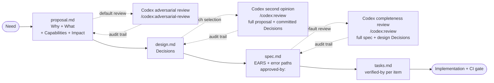

# sdd-codex-starter

**English** | [繁體中文](README.md)

> Turn **Spec-Driven Development** + **AI adversarial second opinion** into a reproducible workflow. Drop it into any project and it just runs.

[](https://github.com/erikhuang76821/sdd-codex-starter/actions/workflows/validate.yml)
[](LICENSE)

Not a framework, no scaffolding scripts — one directory + one `AGENTS.md`. The AI reads it and follows the rules itself.

> **Note on language**: This README is bilingual, but [`AGENTS.md`](AGENTS.md) and [`docs/`](docs/) are written in Traditional Chinese — this is intentional. The rules are designed for an LLM context (which is multilingual), and the original author works in zh-TW. For English-only teams: AI agents read the Chinese rules without issue, and the `MUST` / `SHALL` / structural keywords are English-native, so CI grep works regardless.

---

## What it solves

| Pain | Counter |
|---|---|
| Coding starts before the direction is settled; you only find out at demo time | OpenSpec enforces `proposal → design → specs → tasks` |
| AI-written specs drift in format and skip error paths | EARS alignment + CI requires every Requirement to have a `[異常]` (error) scenario |
| Proposal premise / tech selection / spec completeness all leaning on a single AI's perspective | Codex three-stage review (adversarial + second-opinion + completeness), each running in isolated context, each leaving an audit trail |
| PM / planners can't read design.md and miss out on cross-functional review | Each Decision MUST use layered description: **one-liner / user-visible impact / why-not-chosen (in business language) / technical reasoning** |
| Tasks are too coarse, "done" is ambiguous | Every task maps to a scenario for objective acceptance |

## Workflow



Each arrow has a machine-layer and a rule-layer gate:

| Gate | Machine layer | Rule layer |
|---|---|---|
| proposal → Codex | grep `對抗性審查來源:` | AGENTS §3.1 §8.1 |
| design → Codex | grep `第二意見來源:` | AGENTS §3.2 §8.2 |
| spec → Codex | grep `完備性審查來源:` | AGENTS §3.3 §8.3 |
| design output → cross-functional readability | grep 3 layered-description markers per Decision | AGENTS §3.5 |
| design → spec | `openspec validate --strict` | AGENTS §1 §2 |
| spec → tasks | grep `approved-by:` | AGENTS §7 |
| tasks → commit | grep `→ verified by:` | AGENTS §6 |
| commit → push | `hooks/pre-commit` + CI | AGENTS §9 |

## Install & cross-machine migration

First-time setup and "continue on a new machine" are the **same flow**. Every rule lives in the repo — no "hidden on which machine" dependencies.

### Prerequisites (machine-level, one-time)

| Tool | Purpose | Install |
|---|---|---|
| Node.js 20+ | Runs OpenSpec CLI and the Codex plugin | Official site or `nvm install 24` |
| OpenSpec CLI | SDD tool itself | `npm install -g @fission-ai/openspec` |
| Claude Code | Primary AI agent (Codex CLI / Cursor / Aider also work) | Claude official site |
| ChatGPT login (for codex) | Codex second opinion uses OAuth, no API key | Inside Claude Code, run `/codex:setup` and log in via browser |
| git | Required (obviously) | System default |

### Steps

```bash
# 1. Copy the starter (or git clone into your new project root)
git clone https://github.com/erikhuang76821/sdd-codex-starter.git
cp -r sdd-codex-starter/. <your-project>/
cd <your-project>

# 2. Confirm OpenSpec CLI is on PATH
openspec --version

# 3. (Optional but recommended) enable the local pre-commit hook
ln -s ../../hooks/pre-commit .git/hooks/pre-commit && chmod +x .git/hooks/pre-commit

# 4. Verify starter integrity — should be 79/79 green
bash scripts/test.sh
```

`scripts/test.sh` all-green = **objective proof of "rules are complete"**. Any broken link, missing section, or accidentally-rewritten critical rule gets caught here.

### How each AI agent reads the rules

| Agent | Auto-loaded file | Behaviour |
|---|---|---|
| Claude Code | [`CLAUDE.md`](CLAUDE.md) | Auto-read on entering working dir → points to AGENTS.md |
| Codex CLI / Aider | `AGENTS.md` | Generally scans for the AGENTS name proactively |
| Cursor | `.cursorrules` / `.cursor/rules` (add a stub `→ read AGENTS.md`) | Does not auto-read AGENTS, needs a thin stub |
| Others | — | Just tell the AI "please read `AGENTS.md`" |

### Rule portability (cross-machine essentials)

| | Inside the repo | Cross-machine portable |
|---|---|---|
| SDD flow, Codex intervention, EARS, audit trail, CI rules | ✅ AGENTS.md / docs/ / hooks/ / .github/ | ✅ `git clone` is enough |
| 79 self-test cases | ✅ scripts/test.sh | ✅ Re-runs on any machine |
| Personal preferences (Claude Code memory) | ❌ Local `~/.claude/.../memory/` | ⚠ Doesn't travel with the repo, but **memory inside the starter would be redundant** because the rules are already lifted into AGENTS.md |

Meaning: **when working inside sdd-codex-starter, nothing relies on local memory**. A new machine just needs `git clone` + prereqs and you're complete.

## Getting started

Just tell the AI what you want — **no need to say "please use SDD"**, and **no need to type `openspec` commands**:

| You say | What the AI does automatically |
|---|---|
| "Add a user login feature" | `openspec new change add-user-login` → write proposal → enter design → call Codex when warranted → write spec → write tasks |
| "Pick a frontend framework, candidates Next.js / Nuxt / SvelteKit" | Same flow; design stage auto-invokes Codex for an adversarial second opinion |
| "Refactor the order flow to support multi-currency" | Same flow; cross-system boundary auto-triggers Codex |
| "Build a snake game" | Even a tiny game runs SDD ([AGENTS.md](AGENTS.md) §0 "no exceptions to the rule") |
| "Change the button colour to blue" | Skip SDD, patch directly (pure styling) |

Trigger signals are defined in [`AGENTS.md`](AGENTS.md) §0. You only need to add `<!-- approved-by: -->` at the spec stage and review the Codex second-opinion content.

## Structure

| Path | Purpose |
|---|---|
| [`AGENTS.md`](AGENTS.md) | Mandatory AI ruleset (entry point + 11 sections; phase detail links to docs) |
| [`docs/spec-writing.md`](docs/spec-writing.md) | EARS 5 patterns + mandatory error paths |
| [`docs/task-writing.md`](docs/task-writing.md) | Independently-verifiable task rules |
| [`docs/codex-handoff.md`](docs/codex-handoff.md) | Codex three-stage invocation triggers + full-context templates (A/B/C) |
| [`docs/decision-writing.md`](docs/decision-writing.md) | design.md Decision 4-marker layered-description format (cross-functional readable) |
| [`docs/output-formatting.md`](docs/output-formatting.md) | Codex reply visual block format |
| [`docs/testing.md`](docs/testing.md) | How to run starter self-tests + add new tests |
| [`hooks/`](hooks/) | Local `pre-commit` + install guide |
| [`scripts/test.sh`](scripts/test.sh) | 79 unit + integration tests (local / CI shared) — includes testing matrix consistency (Unit 6) + AGENTS instruction budget (Unit 7) |
| [`scripts/codex-prompt.sh`](scripts/codex-prompt.sh) | Helper: auto-assembles Codex prompts per docs/codex-handoff.md three templates with original content inlined (non-mandatory, doesn't bypass rules) |
| [`.github/workflows/validate.yml`](.github/workflows/validate.yml) | CI: strict validate + 7 structural greps + runs scripts/test.sh |
| [`examples/`](examples/) | 4 reference changes covering 4 trigger types: technical-selection ([`select-admin-frontend-stack`](examples/select-admin-frontend-stack/)) / pure-new-feature ([`add-user-login`](examples/add-user-login/)) / MODIFIED Requirements ([`enable-2fa`](examples/enable-2fa/)) / legitimate Codex audit-skip ([`clarify-login-error-wording`](examples/clarify-login-error-wording/)) |
| `openspec/changes/archive/`, `openspec/specs/` | Empty skeletons, paths expected by the `openspec` CLI |

## Compatibility with multi-agent orchestrators

> **This section is a design-intent statement, not an AGENTS clause** — not enforced by CI or hooks. It only explains the starter's relationship to other frameworks.

SDD discipline and agent orchestration are **orthogonal**:

- **SDD discipline** (proposal → design → spec → tasks + Codex three-stage + audit trail) is governed by [`AGENTS.md`](AGENTS.md), entirely hard-coded in the repo
- **Agent orchestration** (how many agents / who does what / how tasks are dispatched) is decided by the runtime, not in scope here

Meaning: **whichever orchestration you use, as long as you pass through proposal/design/spec/tasks, the same rules apply**.

| Runtime / Framework | Compatibility | Notes |
|---|---|---|
| Single-agent Claude Code | ✅ Native | `CLAUDE.md` auto-points to `AGENTS.md`; `/codex:rescue` subagent runs the three-stage review |
| Codex CLI (standalone) | ✅ | Scans for the `AGENTS.md` name actively; SDD discipline takes effect |
| Cursor / Aider | ✅ | Need a manual `.cursorrules` / equivalent stub `→ read AGENTS.md` |
| OMC (autopilot / team / ralph modes) | ✅ | OMC handles "dispatch N workers", AGENTS handles "each worker MUST run SDD"; non-conflicting |
| claude-flow / similar multi-agent runtimes | ✅ | Same — orchestration runs orchestration, SDD runs SDD |
| GitHub Copilot inline | ⚠ Partial | Doesn't auto-read AGENTS; human review fills the gap; CI grep still backstops at PR time |

### Why this stays orthogonal

- **Rule layer** (AGENTS.md / docs/) only specifies "what MUST be done when entering an SDD phase", not "who does it"
- **Gate layer** (hooks/pre-commit + CI grep + scripts/test.sh) pure-greps file structure; doesn't care which agent wrote it
- **Codex intervention** (§3.1/§3.2/§3.3) is a built-in step within the SDD flow, independent of outer orchestration — `Agent(subagent_type="codex:codex-rescue")` has the same semantics in single-agent and multi-agent settings

### Practical guidance

- When using `/autopilot "build X"` or similar auto modes, AGENTS §0 triggers still apply — expect the worker to run `openspec new change` first, not jump straight into code
- In multi-agent settings, the three-stage Codex audit can be initiated by the lead agent uniformly, or by the worker agent executing the spec stage itself — either is fine; the audit trail goes into the corresponding file
- Whoever calls codex, [§3.4 full context](AGENTS.md) and [§8 audit format](AGENTS.md) do not change

In short: **SDD discipline is an in-repo invariant, not provided by any specific runtime**. Switching runtimes or running multiple agents in parallel doesn't affect the rules, nor the starter's 79 self-tests.

## Design principles

- **Minimal baseline** — No npm/git config, CI/CD templates, or scaffolding scripts; add what you need yourself
- **Rules in code, evidence in repo** — `AGENTS.md` holds the rules, `examples/` holds the evidence, `validate.yml` enforces both
- **Auto-mode safe** — Rules are written so no human needs to remind the LLM in the moment; LLMs in yolo / no-confirm mode still follow them
- **Self-tested** — 79 unit + integration tests ([`scripts/test.sh`](scripts/test.sh)) guard against rule-doc drift (links, section numbering, key phrases, hook behaviour, bootstrap smoothness, codex-prompt assembly correctness, all 4 examples strict-validating, testing matrix consistency, AGENTS instruction budget)
- **Zero hidden dependencies** — Rules live entirely in the repo, no local memory / account secret / cloud API key dependency; `git clone` is complete
- **Cross-functional readable** — design.md is not just for engineers; each Decision MUST use layered description (`**one-liner** / **user-visible impact** / **why-not-chosen** / engineering reasoning`), so PM / planners can review too
- **Instruction budget** — AGENTS.md (always-loaded) stays <100 strong directives (`MUST` / `SHALL` / `不得` / `禁止` / `❌` / `一律`), plus on-demand `docs/` of about 100, totalling within the LLM rule-following stable band of ~200. `scripts/test.sh` Unit 7 enforces AGENTS.md ≤180 (see [docs/testing.md](docs/testing.md) testing matrix)

## Versioning and upgrade

Current version in [CHANGELOG.md](CHANGELOG.md). Semantics:

- **MAJOR**: AGENTS.md clauses non-backward-compatible
- **MINOR**: New rule / new example / new helper; doesn't break existing changes
- **PATCH**: Docs / internal-test expansion

### How to upgrade from an earlier copy

If you've already copied an older starter into your own project and want to upgrade:

1. **Read the CHANGELOG** ([`CHANGELOG.md`](CHANGELOG.md)) from your copied version up to unreleased; note the `Migration / Upgrade Notes` sections
2. **Don't blindly overwrite** — these files you **might have edited**; review the diff before overwriting:
   - `CLAUDE.md` (if you added project-specific quick triggers)
   - `examples/` (if you deleted examples you don't need)
   - `.github/workflows/validate.yml` (if you added project CI)
   - `hooks/pre-commit` (if you added project lint)
3. **Safe-to-rsync directories** (these are starter's own rules — you shouldn't modify):
   - `AGENTS.md`
   - `docs/*.md`
   - `scripts/test.sh`, `scripts/codex-prompt.sh`
4. **Run validation**: `bash scripts/test.sh` must be all green to count as a successful upgrade
5. **Re-run existing changes**: If the CHANGELOG mentions audit trail format changes, MUST update existing `openspec/changes/<id>/` audit fields accordingly

### Breaking change detection

Before upgrading, run this quick check:

```bash
# Compare your current AGENTS.md with the target version's
diff <(cat AGENTS.md) <(git show v<target>:AGENTS.md)
```

If the diff shows additions / removals of audit trail field names / required marker names / MUST / SHALL clauses, that's a breaking change — assess the impact on existing changes before upgrading.

## Acknowledgments

This starter is built on top of [**OpenSpec**](https://github.com/Fission-AI/OpenSpec) ([`@fission-ai/openspec`](https://www.npmjs.com/package/@fission-ai/openspec)) — the SDD CLI that powers the `proposal → design → spec → tasks` workflow, `openspec validate --strict` structural enforcement, and the change-archive model. This starter wraps that foundation with Codex adversarial review and machine-layer audit-trail enforcement. Without OpenSpec, this starter is an empty shell.

The EARS requirements syntax originates from Mavin et al., *Easy Approach to Requirements Syntax*, RE 2009 — see [`docs/spec-writing.md`](docs/spec-writing.md) "進一步閱讀".

## License

MIT — see [LICENSE](LICENSE)
