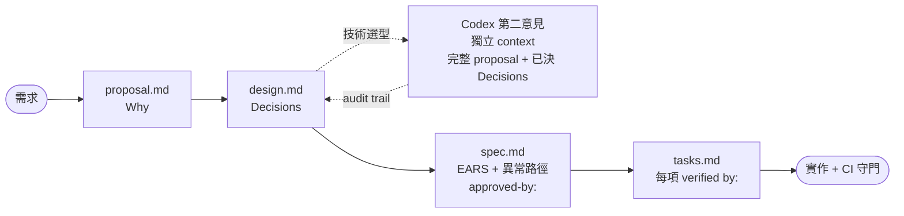

# sdd-codex-starter

> 把 **Spec-Driven Development** 與 **AI 對抗性第二意見** 變成可重現的工作流, 拷到任何專案就能跑。

[](https://github.com/erikhuang76821/sdd-codex-starter/actions/workflows/validate.yml)
[](LICENSE)

不是 framework, 沒有腳手架腳本 — 一個 directory + 一份 `AGENTS.md`, AI 讀完自己照規矩走。

---

## 解決四件事

| 痛點 | 對策 |
|---|---|
| 一開工就寫 code, 等 demo 才發現方向錯 | OpenSpec 強制 `proposal → design → specs → tasks` |
| AI 寫 spec 格式不一、漏異常路徑 | EARS 對齊 + CI 強制每 Requirement 有 `[異常]` scenario |
| 技術選型靠單一 AI 視角 | Codex 對抗性第二意見, 跑在獨立 context, 必留 audit trail |
| Task 太大顆、完成判定模糊 | 每項 task 對應到 scenario, 客觀驗收 |

## 工作流



每個箭頭都有機器層與規則層雙重守門:

| Gate | 機器層 | 規則層 |
|---|---|---|
| design → Codex | grep `第二意見來源:` | AGENTS §3 §8 |
| design → spec | `openspec validate --strict` | AGENTS §1 §2 |
| spec → tasks | grep `approved-by:` | AGENTS §7 |
| tasks → commit | grep `→ verified by:` | AGENTS §6 |
| commit → push | `hooks/pre-commit` + CI | AGENTS §9 |

## 上手 (3 分鐘)

```bash
# 1. 拷到新專案
git clone https://github.com/erikhuang76821/sdd-codex-starter.git
cp -r sdd-codex-starter/. <your-project>/
cd <your-project>

# 2. 裝 OpenSpec CLI
npm install -g @fission-ai/openspec

# 3. 第一個 change
openspec new change my-first-change --description "..."

# 4. (可選) 啟用本機 pre-commit hook
ln -s ../../hooks/pre-commit .git/hooks/pre-commit && chmod +x .git/hooks/pre-commit
```

之後 AI 讀 `AGENTS.md` 自己走流程; 你只負責 spec 階段的 `approved-by:` 與 design 階段的 Codex 諮詢。

## 結構

| 路徑 | 用途 |
|---|---|
| [`AGENTS.md`](AGENTS.md) | AI 必讀工作守則 (10 節) |
| [`docs/spec-writing.md`](docs/spec-writing.md) | EARS 5 pattern + 異常路徑強制 |
| [`docs/task-writing.md`](docs/task-writing.md) | 獨立可驗證 task 規則 |
| [`docs/codex-handoff.md`](docs/codex-handoff.md) | Codex 觸發時機 + 完整 context 模板 |
| [`docs/output-formatting.md`](docs/output-formatting.md) | Codex 回覆視覺區塊格式 |
| [`hooks/`](hooks/) | 本機 `pre-commit` + 安裝指南 |
| [`.github/workflows/validate.yml`](.github/workflows/validate.yml) | CI: strict validate + 4 個結構 grep |
| [`examples/select-admin-frontend-stack/`](examples/select-admin-frontend-stack/) | 完整 reference change (strict validate 通過) |
| `openspec/changes/archive/`, `openspec/specs/` | 空骨架, `openspec` CLI 預期路徑 |

## 設計原則

- **最低底線** — 不含 npm/git 設定、CI/CD 模板、腳手架腳本; 加什麼自己加
- **規則 in code, 證據 in repo** — `AGENTS.md` 寫規則, `examples/` 留證據, `validate.yml` 守規則
- **Auto 模式安全** — 規則寫到不需人類在當下提醒; LLM 在 yolo 模式仍會 follow
- **指令量約束** — 約 108 條硬性指令, 落在 LLM 穩定遵守的 ~200 條安全帶內

## License

MIT — 見 [LICENSE](LICENSE)
