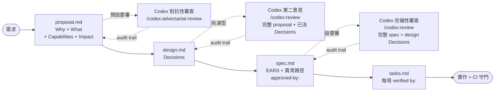

# sdd-codex-starter

[English](README.en.md) | **繁體中文**

> 把 **Spec-Driven Development** 與 **AI 對抗性第二意見** 變成可重現的工作流, 拷到任何專案就能跑。

[](https://github.com/erikhuang76821/sdd-codex-starter/actions/workflows/validate.yml)
[](LICENSE)

不是 framework, 沒有腳手架腳本 — 一個 directory + 一份 `AGENTS.md`, AI 讀完自己照規矩走。

---

## 解決五件事

| 痛點 | 對策 |
|---|---|
| 一開工就寫 code, 等 demo 才發現方向錯 | OpenSpec 強制 `proposal → design → specs → tasks` |
| AI 寫 spec 格式不一、漏異常路徑 | EARS 對齊 + CI 強制每 Requirement 有 `[異常]` scenario |
| 提案論點 / 技術選型 / 規格完備性 靠單一 AI 視角 | Codex 三階段審查 (對抗性 + 第二意見 + 完備性), 跑在獨立 context, 各階段必留 audit trail |
| 企劃 / PM 讀不懂 design.md 的選型理由 → 失去跨職能 review | 每個 Decision 強制分層描述: **一句話 / 對使用者影響 / 為何不選 (業務語言) / 技術理由** |
| Task 太大顆、完成判定模糊 | 每項 task 對應到 scenario, 客觀驗收 |

## 工作流



每個箭頭都有機器層與規則層雙重守門:

| Gate | 機器層 | 規則層 |
|---|---|---|
| proposal → Codex | grep `對抗性審查來源:` | AGENTS §3.1 §8.1 |
| design → Codex | grep `第二意見來源:` | AGENTS §3.2 §8.2 |
| spec → Codex | grep `完備性審查來源:` | AGENTS §3.3 §8.3 |
| design output → 跨職能可讀 | grep 3 個分層描述 marker / Decision | AGENTS §3.5 |
| design → spec | `openspec validate --strict` | AGENTS §1 §2 |
| spec → tasks | grep `approved-by:` | AGENTS §7 |
| tasks → commit | grep `→ verified by:` | AGENTS §6 |
| commit → push | `hooks/pre-commit` + CI | AGENTS §9 |

## 安裝 & 跨機遷移

初次設置與「換電腦繼續用」是**同一套流程**。所有規則都在 repo 內, 沒有「藏在哪台機器」的隱藏依賴。

### Prereq (機器級, 一次性裝)

| 工具 | 用途 | 怎麼裝 |
|---|---|---|
| Node.js 20+ | 跑 OpenSpec CLI 與 Codex 插件 | 官網下載或 `nvm install 24` |
| OpenSpec CLI | SDD 工具本體 | `npm install -g @fission-ai/openspec` |
| Claude Code | 主要 AI agent (任何 OpenAI Codex CLI / Cursor / Aider 也可) | 從 Claude 官網裝 |
| ChatGPT 登入 (codex 用) | Codex 第二意見透過 OAuth, 不需 API key | Claude Code 內跑 `/codex:setup`, 開瀏覽器登入 |
| git | 必備 | 系統內建 |

### 步驟

```bash
# 1. 拷 starter (或 git clone 到新專案 root)
git clone https://github.com/erikhuang76821/sdd-codex-starter.git
cp -r sdd-codex-starter/. <your-project>/
cd <your-project>

# 2. 確認 OpenSpec CLI 在 PATH
openspec --version

# 3. (可選但建議) 啟用本機 pre-commit hook
ln -s ../../hooks/pre-commit .git/hooks/pre-commit && chmod +x .git/hooks/pre-commit

# 4. 驗證 starter 完整 — 應該 79/79 全綠
bash scripts/test.sh
```

`scripts/test.sh` 全綠 = **客觀的「規則齊全」證明**。任何 link 斷裂、章節缺漏、關鍵規則被改錯, 這份測試都會抓到。

### AI agent 怎麼讀規則

| Agent | 自動載入的檔名 | 行為 |
|---|---|---|
| Claude Code | [`CLAUDE.md`](CLAUDE.md) | 一進工作目錄自動讀 → 指向 AGENTS.md |
| Codex CLI / Aider | `AGENTS.md` | 通常主動掃 AGENTS 命名 |
| Cursor | `.cursorrules` / `.cursor/rules` (需自加 stub `→ 讀 AGENTS.md`) | 不會自動讀 AGENTS, 需要薄 stub |
| 其他 | — | 跟 AI 講一句「請讀 `AGENTS.md`」即可 |

### 規則的可攜性 (跨機要點)

| | 在 repo 內 | 跨機可攜 |
|---|---|---|
| SDD 流程、Codex 介入、EARS、Audit Trail、CI 守則 | ✅ AGENTS.md / docs/ / hooks/ / .github/ | ✅ `git clone` 就完整 |
| 47 條自驗測試 | ✅ scripts/test.sh | ✅ 跨機可驗 |
| 個人偏好 (Claude Code memory) | ❌ 本機 `~/.claude/.../memory/` | ⚠ 不會跟 repo 一起搬, 但**進 starter 內 memory 是冗餘的**, 因為規則已 lift 到 AGENTS.md |

意思是: **在 sdd-codex-starter 工作的情境, 完全不依賴本機 memory**。新電腦 clone repo + 裝 prereq 就齊全。

## 開工

直接跟 AI 講你要做什麼 — **不必先說「請走 SDD 流程」**, 也**不必下 `openspec` 指令**:

| 你說 | AI 自動做的事 |
|---|---|
| 「加一個用戶登入功能」 | `openspec new change add-user-login` → 寫 proposal → 進 design → 必要時叫 Codex → 寫 spec → 寫 tasks |
| 「選前端框架, 候選 Next.js / Nuxt / SvelteKit」 | 同上, design 階段自動叫 Codex 給對抗性第二意見 |
| 「重構訂單流程支援多幣別」 | 同上, 跨系統邊界自動觸發 Codex |
| 「製作貪食蛇」 | 即使是小遊戲也走 SDD ([AGENTS.md](AGENTS.md) §0「規則沒有例外」) |
| 「把按鈕顏色改成藍色」 | 跳過 SDD, 直接 patch (純樣式) |

觸發信號定義在 [`AGENTS.md`](AGENTS.md) §0; 你只負責 spec 階段加 `<!-- approved-by: -->` 與審 Codex 的第二意見內容。

## 結構

| 路徑 | 用途 |
|---|---|
| [`AGENTS.md`](AGENTS.md) | AI 必讀工作守則 (入口 + 11 節, 階段細節連到 docs) |
| [`docs/spec-writing.md`](docs/spec-writing.md) | EARS 5 pattern + 異常路徑強制 |
| [`docs/task-writing.md`](docs/task-writing.md) | 獨立可驗證 task 規則 |
| [`docs/codex-handoff.md`](docs/codex-handoff.md) | Codex 三階段介入觸發時機 + 完整 context 模板 (A/B/C) |
| [`docs/decision-writing.md`](docs/decision-writing.md) | design.md Decision 的 4-marker 分層描述格式 (跨職能可讀) |
| [`docs/output-formatting.md`](docs/output-formatting.md) | Codex 回覆視覺區塊格式 |
| [`docs/testing.md`](docs/testing.md) | 怎麼跑 starter 自驗 + 加新測試 |
| [`hooks/`](hooks/) | 本機 `pre-commit` + 安裝指南 |
| [`scripts/test.sh`](scripts/test.sh) | 79 條單元 + 整合測試 (本機 / CI 共用) — 含測試矩陣一致性 (Unit 6) + AGENTS 指令預算 (Unit 7) |
| [`scripts/codex-prompt.sh`](scripts/codex-prompt.sh) | 輔助: 按 docs/codex-handoff.md 三模板, 自動 inline 原文組裝 Codex prompt (非強制, 不繞過規則) |
| [`.github/workflows/validate.yml`](.github/workflows/validate.yml) | CI: strict validate + 7 個結構 grep + 跑 scripts/test.sh |
| [`examples/`](examples/) | 4 個 reference changes 覆蓋 4 種觸發類型: technical-selection ([`select-admin-frontend-stack`](examples/select-admin-frontend-stack/)) / pure-new-feature ([`add-user-login`](examples/add-user-login/)) / MODIFIED Requirements ([`enable-2fa`](examples/enable-2fa/)) / legitimate Codex audit-skip ([`clarify-login-error-wording`](examples/clarify-login-error-wording/)) |
| `openspec/changes/archive/`, `openspec/specs/` | 空骨架, `openspec` CLI 預期路徑 |

## 與 multi-agent orchestrator 的相容性

> **這節是設計意圖陳述, 不是 AGENTS 條款** — 不被 CI 或 hook 強制, 只說明 starter 與其他 framework 的關係。

SDD 紀律與 agent orchestration 是**正交**的兩件事:

- **SDD 紀律** (proposal → design → spec → tasks + Codex 三審 + audit trail) 由 [`AGENTS.md`](AGENTS.md) 規範, 全部寫死在 repo 內
- **Agent orchestration** (用幾個 agent / 怎麼分工 / 任務怎麼派發) 由 runtime 決定, 不在本 starter 範圍

意思是: **不論你用哪種 orchestration, 只要走 proposal/design/spec/tasks 四階段, 就遵守同一套規則**。

| Runtime / Framework | 相容性 | 備註 |
|---|---|---|
| 單 agent Claude Code | ✅ 原生支援 | `CLAUDE.md` 自動指向 `AGENTS.md`; `/codex:rescue` subagent 走三審 |
| Codex CLI (單獨用) | ✅ | 主動掃 `AGENTS.md` 命名; SDD 紀律即生效 |
| Cursor / Aider | ✅ | 需自加 `.cursorrules` / 等價 stub `→ 讀 AGENTS.md` |
| OMC (autopilot / team / ralph 模式) | ✅ | OMC 負責「派幾個 worker」, AGENTS 負責「每個 worker 都要走 SDD」; 二者不衝突 |
| claude-flow / 同類 multi-agent runtime | ✅ | 同上, orchestration 跑 orchestration, SDD 跑 SDD |
| GitHub Copilot inline | ⚠ 部分 | 不會自動讀 AGENTS, 人類 review 補位; PR 提交時 CI grep 仍守底 |

### 為什麼能保持正交

- **規則層** (AGENTS.md / docs/) 只規範「進到 SDD 階段時必須做什麼」, 不規範「誰在做」
- **守門層** (hooks/pre-commit + CI grep + scripts/test.sh) 純粹 grep 檔案結構, 不關心是哪個 agent 寫的
- **Codex 介入** (§3.1/§3.2/§3.3) 是 SDD 流程的內建步驟, 與外層 orchestration 無相依 — `Agent(subagent_type="codex:codex-rescue")` 在單 agent / multi-agent 環境語意相同

### 實務指引

- 用 `/autopilot "build X"` 或同類自動模式時, AGENTS §0 觸發條件仍然生效 — 預期看到 worker 先跑 `openspec new change`, 不直接動 code
- multi-agent 環境下, 三階段 Codex audit 可以由 lead agent 統一發起, 或由執行 spec 階段的 worker agent 自己呼叫 — 兩種都 OK, audit trail 寫進對應檔即可
- 不論誰呼叫 codex, [§3.4 完整 context](AGENTS.md) 與 [§8 留證格式](AGENTS.md) 都不變

簡言之: **SDD 紀律是 repo 內的 invariant, 不依賴特定 runtime 提供**。換 runtime / 多 agent 並用都不影響規則, 也不影響本 starter 的 79 條自驗。

## 設計原則

- **最低底線** — 不含 npm/git 設定、CI/CD 模板、腳手架腳本; 加什麼自己加
- **規則 in code, 證據 in repo** — `AGENTS.md` 寫規則, `examples/` 留證據, `validate.yml` 守規則
- **Auto 模式安全** — 規則寫到不需人類在當下提醒; LLM 在 yolo / no-confirm 模式仍會 follow
- **自驗** — 79 條 unit + integration 測試 ([`scripts/test.sh`](scripts/test.sh)) 守規則文件本身不漂移 (連結、章節編號、關鍵字、hook 行為、bootstrap 流暢度、codex-prompt 組裝正確性、4 個 examples 都 strict-validate 通過、測試矩陣一致性、AGENTS 指令量預算)
- **零隱藏依賴** — 規則全在 repo 內, 無本機 memory / 帳號 secret / 雲端 API key 依賴; `git clone` 即完整
- **跨職能可讀** — design.md 不只給工程看, 每個 Decision 強制分層描述 (`**一句話** / **對使用者影響** / **為何不選** / 工程理由`), 讓 PM / 企劃也能參與 review
- **指令量約束** — AGENTS.md (always-loaded) 維持 <100 條強指令 (`MUST` / `SHALL` / `不得` / `禁止` / `❌` / `一律`), 加上 on-demand 載入的 `docs/` 約 100 條, 總計仍在 LLM 穩定遵守的 ~200 條安全帶內。`scripts/test.sh` Unit 7 守 AGENTS.md 不超過 180 (見 [docs/testing.md](docs/testing.md) 測試矩陣)

## 版本與升級

當前版本見 [CHANGELOG.md](CHANGELOG.md)。版本語意:

- **MAJOR**: AGENTS.md 條款不向後相容
- **MINOR**: 新規則 / 新範例 / 新 helper, 不破既有 change
- **PATCH**: 文件 / 內部測試擴充

### How to upgrade from an earlier copy

若你已拷走某個舊版 starter 到自己的專案, 想升級到新版:

1. **看 CHANGELOG** ([`CHANGELOG.md`](CHANGELOG.md)) 從你拷走的版本一路讀到 unreleased, 留意 `Migration / Upgrade Notes` 段
2. **不要無腦覆蓋** — 下列檔案你**可能改過**, 升級時 review diff 後再決定:
   - `CLAUDE.md` (若你加了專案自己的 quick triggers)
   - `examples/` (若你刪了不需要的範例)
   - `.github/workflows/validate.yml` (若你加了專案 CI)
   - `hooks/pre-commit` (若你加了專案 lint)
3. **可放心 rsync 覆蓋的目錄** (這些是 starter 自身規則, 你不該改):
   - `AGENTS.md`
   - `docs/*.md`
   - `scripts/test.sh`、`scripts/codex-prompt.sh`
4. **跑驗證**: `bash scripts/test.sh` 全綠才算升級成功
5. **重跑既有 change**: 若 CHANGELOG 提到 audit trail 格式改變, MUST 把既有 `openspec/changes/<id>/` 的 audit 欄位同步更新

### Breaking change 偵測

每次升級前可跑這個快速檢查:

```bash
# 比對你當前 starter 與目標版本的 AGENTS.md
diff <(cat AGENTS.md) <(git show v<target>:AGENTS.md)
```

若 diff 內出現 audit trail 欄位名 / 必填 marker 名 / MUST / SHALL 子句的增刪, 那就是 breaking change, 要先評估既有 change 受影響範圍再升。

## License

MIT — 見 [LICENSE](LICENSE)
